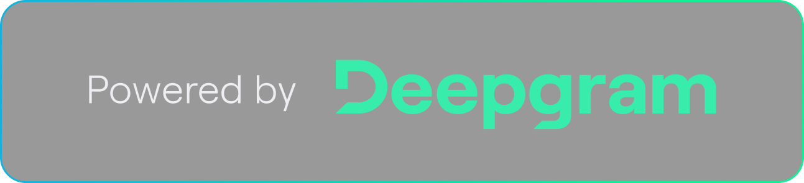


<div align="center" >
    
</div>

<div align="center" >

<h1>
    Seshlog - <span style="color: #f5a623;">Building monuments out of moments.</span>
</h1>
    
<h3>
    Work in Obsidian, record locally, transcribe with Deepgram.
</h3>


  
</div>

<br/>


## What is this?

Seshlog is the new public repo for a focused fork of [Meetily](https://github.com/Zackriya-Solutions/meeting-minutes).  
It is built around one workflow: prepare meetings in Obsidian Markdown, capture high-quality live transcription, and write everything back into your vault in a clean, reusable format.

This is "Cosmic Archaeology": meetings are the ancient ruins of daily work, and Seshlog helps turn fleeting conversation into durable notes you can revisit like a map of the stars.


<p align="center">
  
</p>

<p>
        
    </p>

### Core Workflow

```
PREPARE (Obsidian)    ->    EXECUTE (Live)      ->   PROCESS (Save)
- Load .md file             - Record meeting         - Save transcript back to .md
- Parse prep                - Deepgram STT           - Update status
- Show goals/context        - Speaker labels         - Keep prep sections intact
```

## Why This Fork Exists

- This is now its own public fork and brand: Seshlog.
- Biggest technical shift: Deepgram integration for better real-time transcription quality.
- Biggest workflow shift: Markdown-first prep and output in Obsidian Vault format.

### Why Deepgram?

Most of my meetings are in Dutch. I needed better Dutch transcription quality than local models currently provide, especially for live speaker-labeled output. That specific need is a major reason this fork exists, and why Seshlog uses Deepgram for real-time transcription.

### Why Obsidian?

Obsidian is the note system this project is designed around. Seshlog treats Markdown as the source of truth: start with prep notes, run the meeting, then write transcript and outcomes back to the same file so your vault remains the single place for planning and history.

## Main Changes vs Meetily

- Published and rebranded as Seshlog with its own project identity.
- Added Deepgram transcription provider and settings.
- Added Obsidian Markdown parsing/writing flow for meeting prep and transcript output.
- Introduced a mystical brand voice inspired by the brandbook direction.
- Kept local-first architecture and privacy-oriented workflow from upstream.

## Upstream Credit

This project is a fork of [Meetily](https://github.com/Zackriya-Solutions/meeting-minutes) by Zackriya Solutions.  
Their architecture and open-source foundation made this fork possible.

## Features

- **Obsidian-First Workflow**: Load meeting prep from Markdown files and write outcomes back to your vault.
- **Deepgram Transcription**: Cloud STT with speaker diarization, selected for better multi-language meeting transcription.
- **Local Fallback**: Whisper.cpp for offline transcription when needed.
- **Real-time Display**: Live transcript view during meetings.
- **Privacy-Oriented Architecture**: Local capture and local file handling, with configurable transcription provider.

## Installation

### Windows

```bash
cd frontend
pnpm install
pnpm run tauri:build
```

The installer will be generated in `frontend/src-tauri/target/release/bundle/`.

### Development

```bash
cd frontend
pnpm install
pnpm run tauri:dev
```

## Configuration

1. **Deepgram API Key**: Set your API key in Settings to enable cloud transcription.
2. **Obsidian Vault**: Point to your Obsidian vault to load meeting prep files.
3. **Optional Analytics Key**: Set `SESHLOG_POSTHOG_API_KEY` in your environment to enable analytics.

## Obsidian File Format

### Meeting Prep (Input)

```markdown
---
date: 2026-01-22
type: meeting
attendees: [Attendee A, Attendee B]
status: scheduled
---

# Meeting: Project Kickoff

## Prep
### Goals
- [ ] Align on timeline

### Agenda
1. Introductions

### Context
Background info...
```

### After Recording (Output)

```markdown
---
date: 2026-01-22
type: meeting
attendees: [Attendee A, Attendee B]
status: completed
---

# Meeting: Project Kickoff

## Prep
[... preserved ...]

## Transcript
[00:00:12] **Speaker 1:** Welcome everyone...
[00:00:34] **Speaker 2:** Thanks for having us...
```

## Tech Stack

- **Desktop**: Tauri 2.x (Rust) + Next.js 14 + React 18
- **Audio**: Rust (cpal, professional audio mixing, VAD)
- **Transcription**: Deepgram WebSocket + Whisper.cpp fallback
- **Storage**: Native SQLite via SQLx

## Acknowledgments

Seshlog is built on the excellent foundation of [Meetily](https://github.com/Zackriya-Solutions/meeting-minutes) by Zackriya Solutions. We are grateful for their open-source work on privacy-first meeting transcription.

## License

MIT License
